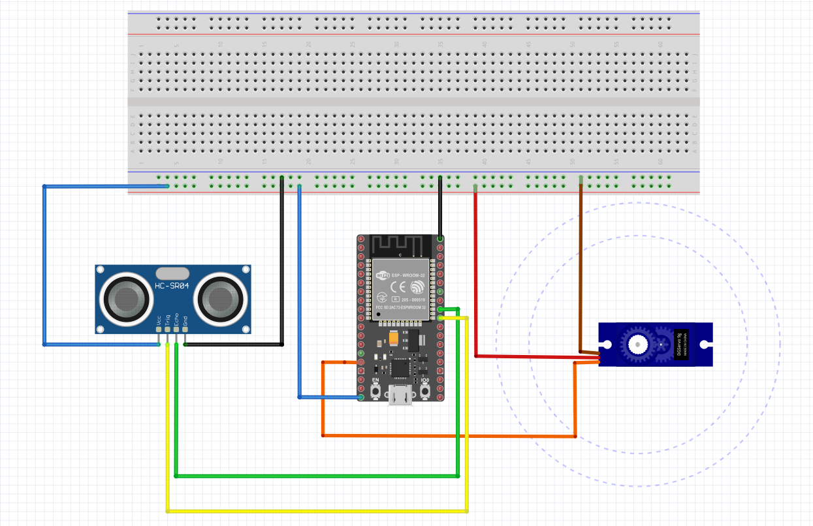
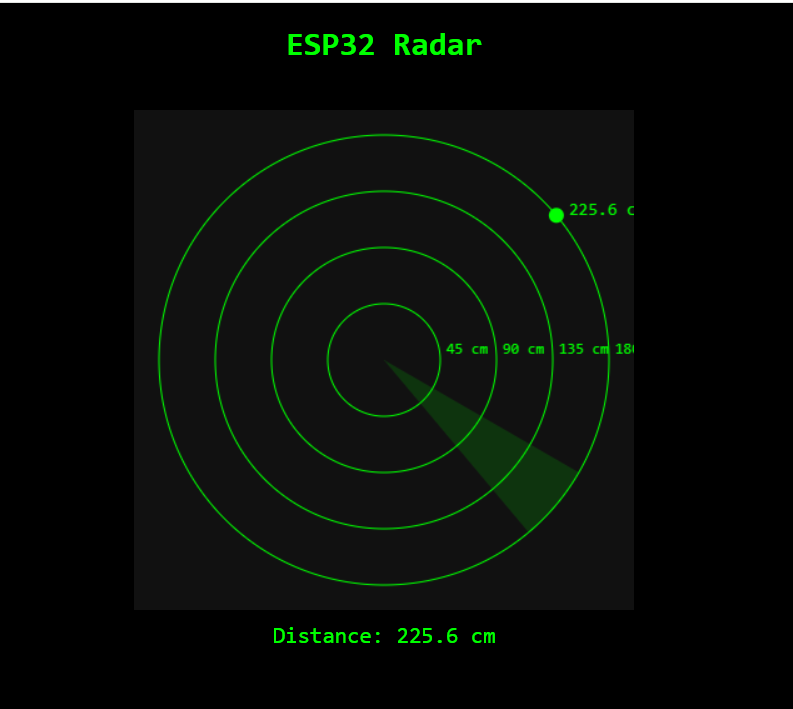

# ESP32 Radar System

This is a servo-based radar prototype built using an ESP32 microcontroller, HC-SR04 ultrasonic sensor, and a real-time HTML5 web interface.

## Features

- Servo sweeps from 0° to 180°
- Ultrasonic sensor measures distance
- WebSocket-based real-time display
- Wi-Fi enabled (ESP32 acts as host)

## Hardware Used

- ESP32 Dev Board
- HC-SR04 Ultrasonic Sensor
- SG90 Micro Servo
- Jumper wires, breadboard
- USB cable for power and upload

## Circuit Diagram

## Web Interface

HTML5 canvas radar display with:
- Sweeping arc
- Detected object distance
- Color-coded proximity markers

## Getting Started

1. Upload `radar.ino` from the `ArduinoCode/` folder
2. Connect to Wi-Fi using your SSID/password
3. Open the IP shown in Serial Monitor in your browser

## License

MIT License
